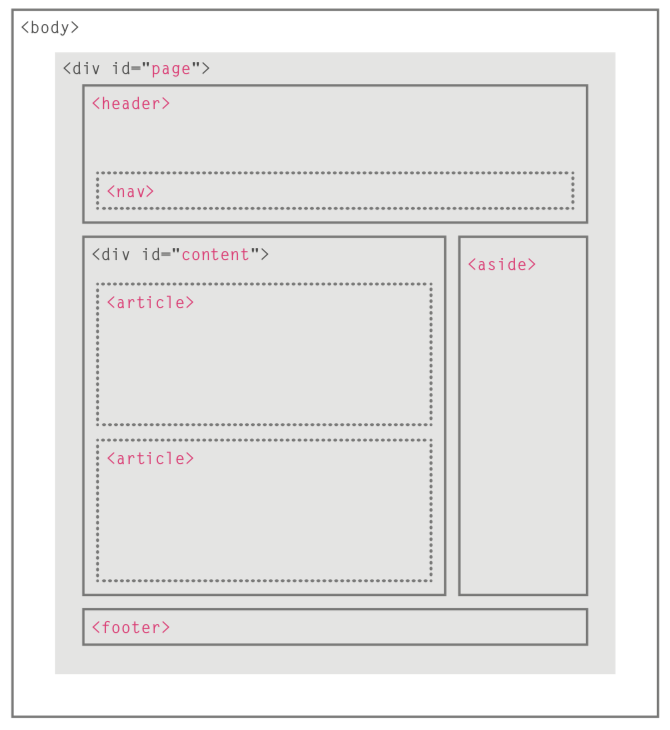

# 网页设计

- Web 的发展
  - Web 1.0: HTML + CSS
  - Web 2.0: JavaScript + Ajax + XML
  - Web 3.0: HTML5 + CSS3

- 三大语言
  - HTML：定义网页结构
  - CSS：定义网页样式
  - JavaScript：定义网页中与用户交互的部分

## 1. HTML5

HTML: 超文本标记语言，是 XML 的一个实例，是一种定义网页的文本，用于编写文本的格式，使用预定义标签。

> HTML 不区分大小写



- 文档类型

```html
<!-- 常用 -->
<!doctype html>
<!-- 公共 -->
<!DOCTYPE HTML PUBLIC "-//W3C//DTD HTML 4.01/EN" "http://www.w3.org/TR/html4/strict.dtd">
<!--  -->
<!DOCTYPE HTML PUBLIC "-//W3C//DTD HTML 4.01Transitional//EN" "http://www.w3.org/TR/html4loose.dtd">
```


- 属性（attribute）
  - `id`：唯一标识
  - `class`：元素所属的类，用于区分不同的元素
  - `title`：元素的额外信息（鼠标悬浮时的提示文本）
  - `tabindex`：Tab 键切换顺序
  - `contenteditable`：元素是否可编辑
  - `draggable`：元素是否可拖拽

### 1.1. 结构

- 主体：`body`
  - 标题：`h1`~ `h6`（heading）
    - `align`：对齐，也可用于段落
      - `left`，`centet`，`right`
  - 段落：`p`（paragraph）
  - 任意区域：`div`（division），也称为分割元素，是其他元素的通用容器。
  - 行内元素：`span`
- 内容
  - 文章：`article`
    - 章节：`section`
  - 主要段落：`main`，可以帮助搜索引擎和其他开发者找到你页面的主要内容
  - 页眉：`header`：显示在浏览器标签中的内容
    - 题目：`title`
  - 页脚：`footer`
    - 题目：`title`
  - 时间：`time`
    - 日期：`datetime`
- 元数据：`meta`
  - 名称：`name`
    - `keywords`：告诉搜索引擎该网页的关键词
    - `description`：网站内容的描述
    - `viewport`：移动端窗口，设计移动端网页
  - 加载类型：`http-equiv`
    - `content-Type`：设定网页字符集，便于浏览器解析与渲染
    - `expires`：设定网页到期时间
    - `refresh`：网页在设定的时间内自动刷新并调向设定的网址
    - `Set-Cookie`：如果网页过期，那么网页存在本地的 cookies 会被自动删除
  - 内容描述：`content`：与`name`和`http-equiv`搭配
  - 字符集：`charset`

[结构示例](./codes/ch1/1.1.html)

```html
<!DOCTYPE html>
<html>
    <meta http-equiv="expires" content="Sunday 26 October 2018 01:00 GMT">

    <head>
        <meta charset="utf-8">
        <title> Test Page </title>
    </head>

    <body>
        <!-- 向用户展示的内容 -->
        Hello
    </body>

</html>
```

### 1.2. 文本格式

- 字体：`font`
  - 字体名称：`face`
  - 大小：`size`
  - 颜色：`color`
- 字体格式
  - 上标、下标：`sup`， `sub`
  - 加粗和强调：`strong`/ `b`
  - 删除线：`s`
  - 下划线：`u`
  - 斜体：`em`
- 段落间（非闭合标签）
  - 换行：`br`（break）
  - 水平标尺：`hr`（horizontal ruler）
- 预格式化：`pre`，维持源代码样式，如果不设置，HTML输出时，会把空格，回车等符号都忽略。
- 辅助内容
  - 引用：`blockquote`
  - 缩写词和首字母缩写词：`abbr`/ `acronym`
  - 引文：`cite`
  - 所有者联系信息：`address`
  - 内容的修改：`ins`/ `del`

### 1.3. 列表、表格

- 列表
  - 有序列表：`ol`（ordered list）
  - 无序列表：`ul`（unordered list）
  - 定义列表：`dl`（definition list）/ `dt`/ `dd`
  - 列表项：`li`（list item）
- 导航：`nav`
- 表格
  - 表格结构：`table`/ `tr`/ `td`/ `th`
  - 表格标题：`caption`
  - 跨行和跨列：`rowspan`/ `colspan`
  - 长表格：`thead`/ `tbody`/ `tfoot`

```html
<nav>
    <p>Things cats love:</p>
    <ul>
        <li>cat nip</li>
        <li>laser pointers</li>
        <li>lasagna</li>
    </ul>
</nav>
```

<nav>
    <p>Things cats love:</p>
    <ul>
        <li>cat nip</li>
        <li>laser pointers</li>
        <li>lasagna</li>
    </ul>
</nav>

### 1.4. 链接、图片

- 锚点：`a`（anchor）
  - 内部链接：`href`，锚文本里必须，用于**跳转**至 `header`、 `footer`，没有则使用 `href=#`
  - 外部链接：`src`，网址或本地路径
  - 快捷键：`accesskey`
  - 跳转：`target`
    - `_self`：当前窗口打开，默认
    - `_blank`：新窗口打开
    - `_parent`：在父框架集中打开
    - `_top`：在整个窗口打开
- 图片：`img`
  - 外部链接：`src`
  - 说明：`alt`， `alt`属性内的文本用于屏幕阅读器以提高无障碍性，并在图像无法加载时显示。
- 图表：`figure`
  - 标题：`figcaption`

```html
<!--将图片变为链接-->
<a href="#">
  
</a>
```

<a href="#">
  
</a>

```html
<!-- 内部链接：跳转至指定 id -->
<a href="#footer"> 跳转到页脚 </a>
<footer id="footer"> 页脚 </footer>
```

<a href="#footer"> 跳转到页脚 </a>

### 1.5. 地图

- 地图：`map`
  - `name`：map名
  - `area`：区域
    - `shape`：图片热区形状
    - `coords`：热区坐标
    - `href`：链接地址

### 1.6. 音频、视频

- 音频：`audio`
  - 外部链接：`src`
  - 控制条：`control`
- 视频：
  - 外部链接：`src`
  - 控制条：`control`
  - 自动播放：`autoplay`
  - 循环播放：`loop`
  - 静音：`muted`
  - 预加载：`preload`
- 内嵌媒体：`embed`
  - 自动播放：`autostart`
  - 循环播放：`loop`
  - 控制面板：`hidden`
  - 开始时间：`starttime`
  - 起始音量：`volumn`
  - 控制面板宽高：`width`，`height`
- 滚动字幕：`marquee`
- 内嵌窗口：`iframe`

```html
<!--音频-->
<audio controls>
  <source src="audio/meow.mp3" type="audio/mpeg" />
</audio>
```

### 1.7. 表单、交互

- 行为：`action`，告诉浏览器在提交用户在表单中输入的信息时应该请求的 URL。设置为空字符串时，表单将被提交给当前地址栏中的 URL，即当前页面。
- 方法：`method`，指定将表单提交给服务器时应该使用的 HTTP 请求方法。默认值为 `get`。
- 加密类型：`enctype`
- 段落框：`fieldset`：
  - 段落框标题：`legend`：
- 标签：`label`：改进光标可用性。在 `label`元素内点击文本，就会触发此控件。
  - 标签名：`for`，与相关元素的 `id`属性相同。
- 输入框：`input`：
  - 类型：`type`，可选 `text`、 `password`、 `date`、 `checkbox`、 `radio`、`submit`、`reset`
  - 未输入时的文本：`placeholder`
  - 默认：`checked`
  - 控件名称：`name`，同一组的单选按钮，取值要一致，这样同一组的按钮才可以起到单选的作用。
  - 控件id：`id`
  - 控件值：`value`
  - 按键：`button`
    - 类型：`type`， `submit`
    - 组名称：`name`，所有相关的单选按钮都应该具有相同的 `name`属性，以创建一个单选按钮组。
  - 必须：`required`
- 下拉列表框：`option`
  - 列表名称：`name`
  - 选项：`option`
    - 值：`value`
- 文本域：`textarea`，支持多行文本输入。
  - 行数：`rows`
  - 列数：`cols`

#### 1.7.1. 输入框

```html
<form action="/submit-cat-photo">
  <!--单选框-->
  <label for="indoor">
    <!-- 默认选项 -->
    <input id="indoor" type="radio" name="indoor-outdoor" checked />Indoor
  </label>
  <label for="outdoor">
    <input id="outdoor" type="radio" name="indoor-outdoor" />outdoor </label
  ><br />
  <!--复选框-->
  <label> <input type="checkbox" name="personality" checked /> Loving </label>
  <label> <input type="checkbox" name="personality" /> Lazy </label>
  <label> <input type="checkbox" name="personality" /> Energetic </label><br />
  <!--单行文本框-->
  <input type="text" placeholder="cat photo URL" required />
  <!--提交-->
  <button type="submit">Submit</button>
</form>
```

#### 1.7.2. 下拉列表框

下拉列表在网页中也常会用到，它可以有效的节省网页空间。既可以单选、又可以多选。

```html
<form action="link" method="post" enctype="multipart/form-data">
  user:
  <!--输入框标签：for 需与 input 中的 id 对应-->
  <label for="email">Email:</label>
  <!--账户密码输入框-->
  <input type="text" name="username" value="1234" id="email" /><br />
  password:
  <input type="password" name="password" /><br />
</form>
```

```html
<form action="link" method="post" enctype="multipart/form-data">
  <!-- 单选 -->
  <label>爱好:</label>
  <select>
    <option value="看书">看书</option>
    <option value="旅游" selected="selected">旅游</option>
    <option value="运动">运动</option>
    <option value="购物">购物</option>
  </select>
</form>
```

```html
<form action="link" method="post" enctype="multipart/form-data">
  <!-- 多选 -->
  <label>爱好:</label>
  <select multiple="multiple">
    <option value="看书">看书</option>
    <option value="旅游">旅游</option>
    <option value="运动">运动</option>
    <option value="购物">购物</option>
  </select>
</form>
```

#### 1.7.3. 日期框

```html
<form>
  <label for="pickdate">Enter a date: </label>
  <input type="date" id="pickdate" name="date" />
</form>
```

<form>
  <label for="pickdate">Enter a date: </label>
  <input type="date" id="pickdate" name="date" />
</form>

## 2. CSS 元素

CSS（Cascading Style Sheets）定义 HTML 元素显示，是为了解决数据与样式分离的问题，于 HTML 4.0 后而产生的。

### 2.1. 引入

#### 2.1.1. 元素内嵌式

优先级最高

```html
<h2 style="color: red">CatPhotoApp</h2>
```

<h2 style="color: red">CatPhotoApp</h2>

#### 2.1.2. 头部内嵌式

```html
<style>
  h2 {
    color: blue;
  }
  .red-text {
    color: red;
  }
  #cat-photo-element {
    /*顺时针*/
    padding: 20px 40px 20px 40px;
    margin: 40px 20px 20px 40px;
  }
</style>

<h2 class="red-text">CatPhotoApp</h2>

```

#### 2.1.3. 头部内嵌链接

```html
<link rel="stylesheet" href="demo.css" />
```

#### 2.1.4. 全局样式覆盖

```css
body { color: red !important; }
```

#### 2.1.5. 第三方样式

```html
<!-- 引入第三方字体 -->
<link
  href="https://fonts.googleapis.com/css?family=Lobster"
  rel="stylesheet"
  type="text/css"
/>

<!-- 引入第三方背景 -->
body { background: url(https://i.imgur.com/MJAkxbh.png); }
```

### 2.2. 盒子模型

- CSS 由两个主要的部分构成：选择器（HTML 元素） + 声明（键值对）
- CSS 包括 3 个重要的属性控制着每个 HTML 元素周围的空间：`padding`、 `border`和 `margin`。
- 如果 `margin`是负数，那么里面的元素会和外面 `margin`重合。


| Attribute          | Options                  | Attribute       | Options        |
| ------------------ | ------------------------ | --------------- | -------------- |
| `color`            |                          | `border-color`  |                |
| `background-color` | `red`/ `transparent`     | `border-width`  | `5px`          |
| `height / width`   | `80vw`/ `75vmin`/ `auto` | `border-style`  | `solid`        |
| `max-width`        | `245px`                  | `border-radius` | `5px/50%`      |
| `opacity`          | `0.7`                    | `padding`       | `5px`/ `1.5em` |
| `line-height`      | `25px`                   | `margin`        | `10px`/ `auto` |

```html
<style>
  .thin-red-border {
    border-color: red;
    border-width: 5px;
    border-style: solid;
  }
  /* 分别写出来 */
  .blue-box {
    background-color: blue;
    color: #fff;
    padding-top: 40px;
    padding-right: 20px;
    padding-bottom: 20px;
    padding-left: 40px;
  }
  /* 写到一行，四个数值顺序是 top, right, bottom, left */
  .blue-box {
    background-color: blue;
    color: #fff;
    padding: 40px 20px 20px 40px;
    margin: -15px;
  }
  .blue-box {
    background-color: blue;
    color: #fff;
    margin-top: 40px;
    margin-right: 20px;
    margin-bottom: 20px;
    margin-left: 40px;
  }
</style>
```

### 2.3. 单位

- 绝对单位
  - 与长度的物理单位挂钩，如：`in`， `mm`和 `px`。
  - 近似于屏幕上的实际测量值，但根据屏幕的分辨率不同，会有一些差异。
- 相对单位
  - 相对于另一个长度值而言：如 `em`或 `rem`。例如， `em`是基于元素的字体大小。如果用它来设置 `font-size`属性，它是相对于**父元素**的 `font-size`而言的。

```html
<style>
  .red-box {
    background-color: red;
    padding: 1.5em;
    margin: 20px 40px 20px 40px;
  }
</style>
```

用视口单位（viewport units），相对于设备的视窗尺寸，百分比相对于父容器元素的尺寸。

| 单位   | 改变   | 例子                           |
| ------ | ------ | ------------------------------ |
| `vw`   | 宽     | `10vw`: 可视宽的 10%           |
| `vh`   | 高     | `3vh`: 可视高的 3%             |
| `vmin` | 高，宽 | `70vmin`: 可视尺寸最小的 70%   |
| `vmax` | 高，宽 | `100vmax`: 可视尺寸最大的 100% |

```html
<style>
  h2 {
    width: 30vw;
  }
</style>
```

### 2.4. 文本、字体

| Attribute         | Options                     | Attribute     | Options       |
| ----------------- | --------------------------- | ------------- | ------------- |
| `text-decoration` | `line-through`/ `underline` | `font-weight` | `bold`/ `200` |
| `text-transform`  | `capitalize`/ `initial`     | `font-family` | `sans-serif`  |
| `text-align`      | `justify`/ `center`         | `font-style`  | `italic`      |
|                   |                             | `font-size`   | `5px`         |

```html
<style>
  h2 {
    font-family: Lobster;
  }
  /* 如果一个字体不能用了，会换到设置的第二个字体 */
  p {
    font-family: Helvetica, sans-serif;
  }
</style>
```

- import 字体

```html
<link href="https://fonts.googleapis.com/css?family=Lobster" rel="stylesheet" type="text/css">
```

### 2.5. 图片

```html
<style>
  .larger-image {
    width: 500px;
  }
  .thin-red-border {
    border-color: red;
    border-width: 5px;
    border-style: solid;
  }
  .border-radius {
    border-radius: 10px;
  }
  .thick-green-border {
    border-color: green;
    border-width: 10px;
    border-style: solid;
    border-radius: 50%;
  }
</style>
```

在 `class`加入每个元素里。

```html
<a href="#">
  
</a>
```

## 3. CSS 选择

### 3.1. 选择器

 class 可以用于很多元素里， id 只能用于一个。

- 优先级：行内 > id > class。
- 同为 class，在 `style`里位置后面的比前面的优先级高。
- 最优先级 `!important`

#### 3.1.1. 标签选择器

```css
selector {property: value}
/*标签选择器：针对整个标签*/
<style type="text/css">
  h1, 
  h2, 
  h3, 
  h4, 
  h5, 
  h6 {
    color: blue;
  }
</style>
```

#### 3.1.2. 类选择器

```css
/*类选择器：针对标签中的 class*/
<style type="text/css">
  p {
    font-size: 12px;
  }
  /*<p class='class_1'>class 1</p>*/
  .class_1 {
    font-size: 18px;
  }
  /*<p class='class_2'>class 2</p>*/
  .class_2 {
    font-size: 24px;
  }
  /*覆盖*/
  .pink-text {
    color: pink !important;
  }
</style>
```

#### 3.1.3. ID 选择器

```css
/*ID 选择器：针对标签中的 id*/
<style type="text/css">
  /*<p id='id_1'>id 1</p>*/
  #id_1 {
    font-size: 18px;
  }
  /*<p id='id_2'>id 2</p>*/
  #id_2 {
    font-size: 24px;
  }
</style>
```

#### 3.1.4. 属性-值选择器

```css
/*属性-值选择器*/
<style>
  [type="radio"] {
    margin: 20px 0px 20px 0px;
  }
</style>

/* 最优先级 */
<style>
  .pink-text {
    color: pink !important;
  }
</style>
```

### 3.2. 自定义变量

```html
<style>
  /* 先创建一个变量 */
  .penguin {
    --penguin-skin: gray;
    position: relative;
    margin: auto;
    display: block;
    margin-top: 5%;
    width: 300px;
    height: 300px;
  }

  .penguin-top {
    top: 10%;
    left: 25%;
    /* 第二个参数为 fallback 值，如果变量失效了的话会使用这个 */
    background: var(--penguin-skin, black);
    width: 50%;
    height: 45%;
    border-radius: 70% 70% 60% 60%;
  }
</style>
```

### 3.3. 声明

#### 3.3.1. 嵌套声明

```css
/*嵌套声明：针对标签中的区域*/
<style type="text/css">
  /*针对 span*/
  p {
    color: blue;
    text-align: center;
  }
  .marked {
    background-color: red;
  }
  .marked p {
    color: white;
  }
  p.marked {
    text-decoration: underline;
  }
</style>
```

#### 3.3.2. 集体声明

```css
/*集体声明*/
<style type="text/css">
  /*针对 span*/
  h1, 
  p {
    text-align: center;
  }
</style>
```

#### 3.3.3. 全局声明

```css
/*全局声明*/
<style type="text/css">
  /*针对 span*/
  * {
    text-align: center;
  }
</style>
```

### 3.4. 继承

```css
/*设定 body 中所有元素的字体*/
body {
  font-family: Verdana, sans-serif;
}

/*变量继承*/
<style>
  /*全局继承：可被 class / id 覆盖*/
  /*匹配根元素，会被下面的选择器覆盖*/
  :root {
    --penguin-skin: pink;
  }

  /*动画*/
  @media (max-width: 350px) {
    :root {
      --penguin-size: 200px;
      --penguin-skin: black;
    }
  }

  .penguin {
    --penguin-skin: gray;
  }

  .penguin-top {
    background: var(--penguin-skin);
  }
</style>
```

## 4. CSS3

### 4.1. 定位、盒子属性

CSS3 定位分为三个层级

- 文档流（flow）：默认
  - `block`：使行级元素可定义宽度和高度
  - `inline`：根据插入元素自动调节宽度和高度，如 `<span>`、 `<a>`
  - `inline-block`：如 ``
- 浮动定位（float）：定向浮动排列
  - `float`：浮动方向，如 `left`、 `right`
  - `clear`：清除浮动，如 `left`、 `right`、 `both`
- 层定位（layer）：层叠结构
  - `position`
    - `static`：默认
    - `fixed`：相对于浏览器窗口
    - `relative`
    - `absolute`：相对于 static 定义外的第一个父元素
  - 偏移：`top`、 `bottom`、 `left`、 `right`
  - 叠加索引（z-index）：由下到上


```html
<style>
  /*突出文本框*/
  #thumbnail {
    /*box-shadow: offset-x, offset-y, blur-radius, spread-radius*/
    box-shadow: 0 10px 20px rgba(0, 0, 0, 0.19), 0 6px 6px rgba(0, 0, 0, 0.23);
  }
</style>
```

### 4.2. 背景、颜色

- `rgba()`：r = red, g = green, b = blue, a = alpha/level of opacity
- `hsl()`：h = hue, s = saturation, l = lightness

```html
<style>
  div {
    border-radius: 20px;
    margin: 50px auto;
    /*整体渐变*/
    /*linear-gradient(gradient_direction, color 1, color 2, color 3, )*/
    background: linear-gradient(35deg, #ccffff, #ffcccc);
    /*条带渐变*/
    /*repeating-linear-gradient(0px [yellow -- blend -- blue] 40px [green -- blend -- red] 80px)*/
    background: repeating-linear-gradient(
      45deg, 
      yellow 0px, 
      yellow 40px, 
      black 40px, 
      black 80px
    );
  }
  body {
    background: url(https://cdn-media-1.freecodecamp.org/imgr/MJAkxbh.png);
  }
</style>
```

### 4.3. 交互、变形函数

| interact function |     | transform function   |          |
| ----------------- | --- | -------------------- | -------- |
| `hover`           |     | `scale()`            | `2.1`    |
|                   |     | `skewX()`/ `skewY()` | `-32deg` |
|                   |     | `rotate()`           | `-45deg` |
|                   |     |                      |          |

```html
<style>
  /*a 标签，盘旋改变样式*/
  a {
    color: #000;
  }
  a:hover {
    color: blue;
  }
  p {
    transform: skewX(-32deg);
  }
</style>
```

### 4.4. 动态

| 动态代码                    | 含义                          |
| --------------------------- | ----------------------------- |
| `animation-name`            | 名字，和 `@keyframes`后面对应 |
| `animation-duration`        | `s`, `ms`                     |
| `animation-fill-mode`       | `forwards`                    |
| `animation-iteration-count` | `2`, `infinite`               |
| `animation-timing-function` | ,                             |

- `animation-timing-function`
  - `ease`：慢→快→慢
  - `ease-out`：快→慢
  - `ease-in`：慢→快
  - `linear`：匀速
  - `cubic-bezier(X1, y1, x2, y2)`：根据坐标轴移动, x 是时间，y 是 change 距离

```html
<style>
  /*动态总参数*/
  #rect {
    animation-name: rainbow;
    animation-duration: 4s;
    animation-fill-mode: forwards;
    animation-iteration-count: infinite;
  }

  /*动态规则*/
  @keyframes rainbow {
    0% {
      background-color: blue;
      animation-timing-function: linear;
      /*等价形式*/
      animation-timing-function: cubic-bezier(0.25, 0.25, 0.75, 0.75);
    }
    50% {
      background-color: green;
      animation-timing-function: ease-out;
    }
    100% {
      background-color: yellow;
    }
  }
</style>

<div id="rect"></div>
```

### 4.5. 媒体

```html
<style>
  @media (max-height: 800px) {
    p {
      font-size: 10px;
    }
  }

  @media (min-height: 350px) {
    /* CSS Rules */
  }
</style>
```

## 5. 布局

### 5.1. Flexbox

#### 5.1.1. 排列

- `flex-direction`
  - `row`：左右正常排序
  - `column`：上下正常排序
  - `row-reverse`：左右顺序相反
  - `column-reverse`：上下顺序相反
- `justify-content`
  - `center`：居中对齐              |
  - `flex-start`：都向左或向上对齐
  - `flex-end`：都向右或向下对齐
  - `space-between`：items 都左右或上下顶头
  - `space-around`：两旁留有 half space
  - `space-evenly`：两旁留有 full space
- `align-items`
  - `stretch`：充满页面
  - `center`：居中
  - `flex-start`：都向上或向左对齐
  - `flex-end`：都向下或向右对齐
  - `baseline`：原本大小, 居上或居左

#### 5.1.2. 其他

- `flex-wrap`：自动换行
  - `nowrap`
  - `wrap`：从左到右或从上到下
  - `wrap-reverse`：从右到左或从下到上
- `flex`：元素大小
  - `flex-basis`：元素大小，单位 `px`, `em`, `%`, 也可以 `auto`
  - `flex-shrink`：大小，数字越大，元素越小
  - `flex-grow`：与上面相反，数越大，元素越大

| Attribute       | Options              |
| --------------- | -------------------- |
| `display`       | `flex`/ `grid`       |
| `justify-items` | `center`/ `end`      |
| `justify-self`  | `start`/ `center`    |
| `align-self`    | `center`/ `flex-end` |

```html
<style>
  #box-container {
    display: flex;
    height: 500px;
  }
  #box-1 {
    background-color: dodgerblue;
    flex: 2 2 150px;
    height: 200px;
  }

  #box-2 {
    background-color: orangered;
    flex: 1 1 150px;
    height: 200px;
  }
</style>
```

### 5.2. Grid

#### 5.2.1. 占据格子

```html
<style>
  .item5 {
    grid-column: 2 / 4;
    grid-row: 2 / 4;
    grid-area: 2/2/4/4;
    /* 根据命名，规定 item 占据的格子 */
    grid-area: header;
  }
</style>
```

#### 5.2.2. 分割尺寸

- `grid-template-areas`
- `grid-template-rows`
- `grid-template-columns`
  - `auto`: 原本的大小
  - `fr`: 可用空间的部分
  - `%`：container 的百分比
  - `repeat(times, option)`
  - `times`: `integer`, `auto-fit`, `auto-fill`
  - `minmax(min, max)`

```html
<style>
  .container {
    font-size: 40px;
    min-height: 300px;
    width: 100%;
    background: LightGray;
    display: grid;
    grid-template-areas:
      "header header header"
      /*. 表示空白占位*/
      ". content content"
      "footer footer footer";
  }
</style>
```

#### 5.2.3. 调整间隔

| Attribute         | Options   |
| ----------------- | --------- |
| `grid-row`        | 1 / 3     |
| `grid-gap`        | 10px 20px |
| `grid-column-gap` | 10px      |

```html
<style>
  @media (min-width: 300px){
    .container{
      grid-template-columns: auto 1fr;
      grid-template-rows: auto 1fr auto;
      grid-template-areas:
        "advert header"
        "advert content"
        "advert footer";
    }
  }

  @media (min-width: 400px){
    .container{
      grid-template-areas:
        "header header"
        "advert content"
        "footer footer";
    }
  }
</style>
```

## 6. CSS 库

### 6.1. Sass & Scss

Sass 是一门高于 CSS 的元语言，它能用于清晰地、结构化地描述文件样式，有着比普通 CSS 更加强大的功能。Sass 能够提供更简洁、更优雅的语法，同时提供多种功能来创建可维护和管理的样式表。Sass 是使用 Ruby 语言编写的一款 CSS 预处理语言，它诞生于 2007 年，是最大的成熟的 CSS 预处理语言。

Scss 是 Sass 3 引入新的语法，是 Sassy CSS 的简写，是 CSS3 语法的超集，也就是说所有有效的 CSS3 样式也同样适合于 Sass。说白了 Scss 就是 Sass 的升级版，其语法完全兼容 CSS3，并且继承了 Sass 的强大功能。Sass 是以严格的缩进式语法规则来书写，不带 `{}`和 `;`，而 Scss 的语法书写和我们的 CSS 语法书写方式非常类似。

- 特点
  - 层叠类标签样式
  - 使用 `$`声明变量
  - 使用 `@import`导入本地样式
  - 使用 `@extend`继承样式
  - 使用 `@mixin`定义函数样式
  - 使用 `@if`、 `@else`定义条件样式
  - 使用 `@for`、 `@while`循环定义样式
  - 使用 `@each`映射样式

```css
/* 导入本地样式：_variables.scss */
@import 'variables'

/* 层叠类标签样式 */
<style type='text/scss'>
  /* 变量声明 */
  $text-color: red;
  .blog-post { 
    h1 {
     text-align: center;
     color: $text-color;
    }
    p {
        font-size: 20px;
    } 
  }  
</style>

/* 函数样式 */
<style type='text/scss'>
  @mixin border-radius($radius){
    -webkit-border-radius:$radius;
    -moz-border-radius:$radius;
    -ms-border-radius:$radius;
    border-radius:$radius;
  }

  #awesome {
      width: 150px;
      height: 150px;
      background-color: green;
      @include border-radius(15px);
    }
</style>

/* 条件函数样式 */
<style type='text/scss'>
  @mixin border-stroke($val) {
    @if $val == light {
      border: 1px solid black;
    }
    @else if $val == medium {
      border: 3px solid black;
    }
    @else if $val == heavy {
      border: 6px solid black;
    }
    @else {
      border: none;
    }
  }

  #box {
    width: 150px;
    height: 150px;
    background-color: red;
    @include border-stroke(medium);
  }
</style>

<style type='text/scss'>
/* 循环实现 1 */
@for $j from 1 through 5 {
    .text-#{$j} { font-size: 15px * $j; }
  }

/* 循环实现 2 */
$x: 1;
@while $x < 11 {
  .text-#{$x} { 
    font-size: 15px * $x;
  }
  $x: $x + 1;
}

/* 映射 */
@each $color in blue, black, red {
    .#{$color}-bg { background-color: $color; }
  }
</style>

/* <p class="text-1">Hello</p>
<p class="text-2">Hello</p>
<p class="text-3">Hello</p>
<p class="text-4">Hello</p>
<p class="text-5">Hello</p>

<div class="white-font"></div>
<div class="black-font"></div>
<div class="blue-font"></div> */

/* 继承 */
<style type='text/scss'>
  .info{
    width: 200px;
    border: 1px solid black;
    margin: 0 auto;
  }
  .info-important {
    /* 扩充 */
    @extend .info;
    background-color: magenta;
}
</style>

/* <div class="info-important">
  <p>abc</p>
</div>

<div class="info">
  <p>abcde</p>
</div> */
```

### 6.2. Bootstrap

- `div`
  - `container-fluid`
  - `row`：铺满行
  - `col-xs-4`：铺满列 25%
  - `well`：框
- `img`
  - `img-responsive`
- `button`
  - `btn`
  - `btn-default`：方块
  - `btn-block`：长条
  - `btn-primary`：深蓝色
  - `btn-info`：浅蓝色
  - `btn-danger`：红色
  - `target`：选中框
- `i`(icon)
  - `fas`
  - `fa-thumbs-up`
  - `fa-info-circle`
  - `fa-trash`
  - `fa-paper-plane`
- `span`
  - `text-danger`
- `input`
  - `class="form-control`

```html
<link rel="stylesheet" href="https://maxcdn.bootstrapcdn.com/bootstrap/3.3.7/css/bootstrap.min.css" integrity="sha384-BVYiiSIFeK1dGmJRAkycuHAHRg32OmUcww7on3RYdg4Va+PmSTsz/K68vbdEjh4u" crossorigin="anonymous"/>
<!-- style 之后的所有 HTML 元素都应该嵌套在.container-fluid 中 -->
<div class="container-fluid">

</div>

<!-- 适应页面宽度 -->

<!--  -->
<button class="btn btn-default">Like</button>
<button class="btn-block">Like</button>
```

<footer id="footer">页脚</footer>
