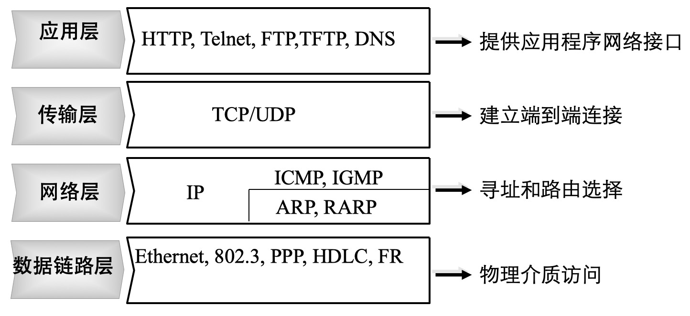

# 网络模型

## 1. OSI 模型

### 1.1. 简介

OSI 模型: 开放式通信系统互联参考模型（Open Systems Interconnection Reference Model, OSI/RM），是国际标准化组织（ISO）提出的一个试图使各种计算机在世界范围内互连为网络的标准框架。

OSI 模型将网络结构抽象为 7 层: 
- 应用层
- 表示层
- 会话层
- 传输层
- 网络层
- 链路层
- 物理层


### 1.2. TCP/IP 协议族

TCP/IP 协议：互联网协议包含了上百种协议标准，但，最重要的两个协议是 TCP 和 IP 协议，故，大家把互联网的协议简称 TCP/IP 协议；

TCP/IP 模型：将 OSI 模型简化为**四层**；



### 1.3. 协议


| 协议 |                    | 层级   |
| ---- | ------------------ | ------ |
| DNS  | 域名系统           | 应用层 |
| DHCP | 动态主机配置协议   | 应用层 |
| FTP  | 文件转移协议       | 应用层 |
| HTTP | 超文本转移协议     | 应用层 |
| TFTP | 简单文件转移协议   | 应用层 |
| SMTP | 简单邮件转移协议   | 应用层 |
| TCP  | 传输控制协议       | 传输层 |
| UDP  | 用户数据报协议     | 传输层 |
| IP   | 因特网协议         | 网络层 |
| ICMP | 因特网控制消息协议 | 网络层 |
| IGMP | 因特网组管理协议   | 网络层 |
| ARP  | 地址解析协议       | 网络层 |
| RARP | 反向地址解析协议   | 网络层 |

- 应用层：应用程序可自建协议；
- 传输层：必须通过 IP 才能和链路层进行通信；
- 网络层：ICMP 和 IGMP 必须通过 IP 才能和链路层通信，ICMP 可直接与应用层通信，ARP 和 RARP 只与链路层通信的协议；

**链路层**


| 类型 | 协议 |
| ---- | ---- |
| 0800 | IP   |
| 0806 | ARP  |
| 8035 | RARP |

**ARP**


**网络层和传输层**


## 2. 网络地址

### 2.1. IPv4

IPv4 地址（逻辑地址）: 用于在网络中标记一台电脑的一串数字，在本地局域网上是惟一的；

- IPv4 地址均由 4 个 4 字节，即 32 个二进制数组成，每类 IPv4 地址的最小值用于显示网络区段，最大值用于广播，这两个值往往不会进行分配
- A 类 IPv4 地址中的**127.0.0.1 -- 127.255.255.255**用于回路测试；
- **127.0.0.1**可代表本机 IPv4 地址，用 http://127.0.0.1 就可测试本机中配置的 Web 服务器；

| 类别 | 网络地址占用字节 | 主机地址占用字节 | IP 地址范围                 | 可用网络个数 | 每个网络能容纳主机 |
| ---- | ---------------- | ---------------- | --------------------------- | ------------ | ------------------ |
| A    | 1                | 3                | 1.0.0.1 - 126.255.255.254   | 126          | 1677214            |
| B    | 2                | 2                | 128.1.0.1 - 191.255.255.254 | 16384        | 65534              |
| C    | 3                | 1                | 192.0.1.1 - 223.255.255.254 | 2097152      | 254                |
| D    | 不指向特定的网络 |                  | 224.0.0.1 - 239.255.255.254 |              |                    |
|      | 只被用于多点广播 |                  |                             |              |                    |
| E    | 仅作实验和开发用 |                  |                             |              |                    |

### 2.2. 私有 IP

私有 IP：国际规定有一部分 IPv4 地址是用于我们的局域网使用，不在公网中使用的 IP 地址；

| 类别 | 起始 IP 段  | 终止 IP 段      |
| ---- | ----------- | --------------- |
| A    | 10.0.0.0    | 10.255.255.255  |
| B    | 172.16.0.0  | 172.31.255.255  |
| C    | 192.168.0.0 | 192.168.255.255 |

### 2.3. 子网掩码

子网掩码不能单独存在，它必须结合 IP 地址一起使用。子网掩码只有一个作用，就是将某个 IP 地址划分成网络地址和主机地址，只有通过子网掩码，才能表明一台主机所在的子网与其他子网的关系，使网络正常工作。

与 IP 地址相同，子网掩码的长度亦为 32 位，左边是网络位，用二进制数字 1 表示，右边是主机位，用二进制数字 0 表示。子网掩码与 IPv4 地址进行按位与操作，可得到 IPv4 地址所在的网络段（末位为 0）

若一个网络的规模不超过 254 台电脑，使用 255.255.255.0 作为子网掩码就可了，假如在一所大学具有 1500 多台电脑，这种规模的局域网可使用 255.255.0.0；

### 2.4. MAC 地址

MAC 地址（硬件地址）：由 6 个字节组成，前 3 个表示网卡许可，后 3 个是网卡产品序列号；

- ping 命令会先调用 ARP（包含目标 IP 地址），通过交换机将 ARP 广播发送给其连接的所有设备，然后返回网关的 MAC 地址，然后请求方 PC 调用 ICMP 向目的 PC 发送消息；
- 当 MAC 地址为十六进制，则会发送给 ARP，反之会发送给 IP；

```bash
# 设置 IP 和掩码
ifconfig eth0 192.168.5.40
netmask 255.255.255.0
# 设置网关
route add default gw 192.168.5.1
# 查看域名解析的 IPv4 地址
nslookup baidu.com
```

## 3. Socket

### 3.1. 创建、修改

Socket（套接字）是进程间通信的一种方式，它能实现不同主机间的进程间通信，用于解决传输层以下的通信；


- Socket = IP address + Protocol + Port
   - 创建：socket.socket(AddressFamily, Type)
      - AddressFamily
         - AF_INET，用于网络进程间通信
         - AF_UNIX，用于同台机器进程间通信
      - Type
         - SOCK_STREAM（流式套接字，主要用于 TCP）
         - SOCK_DGRAM（数据包套接字，主要用于 UDP）
   - 修改设置：setsockopt(SOL_SOCKET, Type)
      - Type
         - SO_BROADCAST，主要用于 UDP 广播
         - SO_REUSEADDR，主要用于 TCP 服务器

### 3.2. 端口

计算机通过 IP+端口号区分不同网络服务。

- 端口号只有整数，范围是从 0 到 65535，Linux 共拥有 65536 ($2^{16}$) 个端口
- 端口号不是随意使用的，而是按照一定的规定进行分配
- 知名端口: 端口号为 0-1023 的端口，如端口 80 分配给 HTTP 服务，端口 21 分配给 FTP 服务
- 动态端口: 端口号为 1023-65535 的端口，动态分配给相应服务
- 查看端口状态: netstat --an

| Protocol | Port  | Socket   |
| -------- | ----- | -------- |
| HTTP     | 80    | TCP      |
| FTP      | 20/21 | TCP      |
| Telnet   | 23    | TCP      |
| SMTP     | 25    | TCP, UDP |
| DNS      | 53    | UDP      |
| TFTP     | 69    | UDP      |
| SNMP     | 161   | UDP      |

## 4. UDP

UDP 是一个**面向数据包**的、**无连接**的通信协议，一般用于多点通信和实时的数据业务

- UDP 不提供可靠性，它只是把应用程序传给 IP 的数据报（datagram）发送出去，每个数据报能否到达目的地、到达目的地的时间、内容的正确性均是不能被保证的
- UDP 在传输数据报前不用在客户和服务器之间建立一个连接，且**没有超时重发**等机制，故而传输速度很快（注重速度流畅）
- UDP 传输数据时有大小限制，每个被传输的数据报必须**< 64 kB**

### 4.1. 服务端

一般情况下，为了让其他的客户端能够正确发送到此进程，服务器端需要绑定端口，而客户端一般不需要绑定，而是让操作系统随机分配，这样就不会因为需要绑定的端口被占用而导致程序无法运行；

### 4.2. 广播

通过 UDP 进行广播，需要使用 socket.socket().setsockopt(s.SOL_SOCKET, s.SO_BROADCAST, 1) 修改 UDP 套接字参数；

每类 IPv4 地址最小值用于显示网络区段，最大值用于广播，即末位为 255，C 类地址广播地址多为 192.168.1.255；

## 5. TCP 原理

### 5.1. 握手和挥手

TCP 模型中，在通信开始前，一定要先建立相关的链接，才能发送数据，类似于生活中"打电话"；

- SYN（synchronous）：TCP/IP 建立连接时使用的握手信号；
- ACK（Acknowledgement）：确认字符，表示发来的数据已确认接收无误；
- 当发送方接收到 ACK 信号时，就可发送下一个数据。若发送方没有收到信号，则发送方会重发当前的数据包；
- 当一端收到一个 FIN，内核让 read 返回 0 来通知应用层另一端已经终止了向本端的数据传送；
- 发送 FIN 通常是应用层对 socket 进行关闭的结果；


- 连接状态
   - 客户端: SYN_SENT
   - 服务端: LISTEN、SYN_RCV
   - 共同: ESTABLISHED
- 关闭状态
   - 客户端：FIN_WAIT1（调用 `close()` ）、FIN_WAIT2、TIME_WAIT
   - 服务端：CLOSE_WAIT（ `recv()` 数据为空）、LASK_ACK（调用 `close()` ）
   - 共同：CLOSED

### 5.2. 监听的队列长度

 `listen()` 中的参数表示已经建立链接和半链接的总数，若当前已建立链接数和半链接数以达到设定值，则新客户端就不会连接成功，而是等待服务器；

> Linux 中，无论 `listen()` 中的参数为多少，系统会自动给定 1 个值；

### 5.3. 短链接

短链接多用于网站，一般只会在 client/server 间传递一次读写操作

1. client 向 server 发起连接请求
2. server 接到请求，双方建立连接
3. client 向 server 发送消息
4. server 回应 client
5. 一次读写完成，此时双方任一个都可发起 close 操作

### 5.4. 长链接

长链接多用于视频、游戏等，是在短链接基础上

- 一次读写完成，连接不关闭
- 后续读写操作
- 长时间操作后，client 发起关闭请求

## 6. TCP 服务器

单进程服务器同一时刻只能为一个客户进行服务，多线程往往用于代替多进程服务器；

### 6.1. 非阻塞版

当服务器为一个客户端服务时，而另外的客户端发起了 connect，只要服务器 listen 的队列有空闲的位置，就会为这个新客户端进行连接，但当服务器为这个新客户端服务时，可能一次性把所有数据接收完毕

- 非阻塞模式下，accept 时，恰巧没有客户端 connect，则 accept 会产生一个异常，所以需要 try 来进行处理

### 6.2. select 版

 `select()` 遍历判断套接字列表中的元素是否可接收消息，返回可接收消息的套接字。 `select()` 为 Unix 和 Linux 底层操作，效率很高。缺点是，单进程能够监听的文件描述符最大数量存在限制，Linux 一般为 1024，即最多为 1023 个客户服务，当套接字较多时，每次 `select()` 都要遍历所有套接字来完成调度，会浪费很多时间。

### 6.3. epoll 版

poll 与 select 类似，均使用轮询机制，但没有最大并发连接的限制。
- epoll 使用事件通知机制，效率提升，不会随着 FD 数目的增加效率下降
- epoll 最大的优点就在于它只管活跃的连接，而跟连接总数无关
- epoll 只能在 Linux 中运行，是对套接字的 FD 操作
- FD: 文件描述符 (file descriptor)，为系统管理时对进程的编号，对象.fileno() 可查看
- LT 模式 (level trigger， 默认): 下次调用 epoll 时，会再次通知未处理描述符事件
- ET 模式 (edge trigger): 下次调用 epoll 时，不会再次通知未处理描述符事件

### 6.4. gevent 版

gevent 由 greenlet 基础上封装而成，其原理是当一个 greenlet 遇到 IO 操作时，就自动切换到其他的 greenlet，等到 IO 操作完成，再在适当的时候切换回来继续执行。
