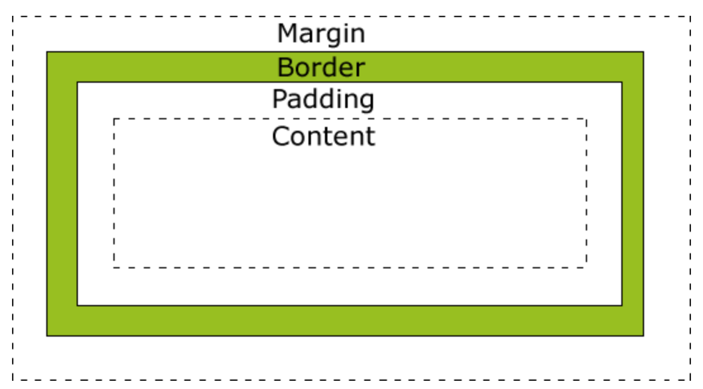

# 静态页面

## 1. 引言

网站是按照一定的规则，使用HTML超文本标记语言等工具制作的、用于展示特定内容的相关网页的集合。学习网站开发的基本是学习制作网页。

### 1.1. 网页的构成元素

- 文本

- 图像

- 超链接

  超链接可以指向一幅图片、一个电子邮件地址、一个文件、一个程序，也可以是本网页中的其他位置。超链接的载体可以是文本、图片或者Flash动画等。

- 表单

- 其他元素

  导航条、GIF动画、音频、视频、框架等

### 1.2. 静态网页

静态网页是相对于动态网页而言的，是指没有后台数据库、不含程序和不可交互的网页。静态网页的更新相对比较麻烦，适用于一般更新较少的展示型网站。

### 1.3. 三大语言

- HTML：定义网页结构
- CSS：定义网页样式
- JavaScript：定义网页中与用户交互的部分

## 2. HTML5

超文本标记语言，用于定义网页的结构。通常有开始和结束标签，例如`<p> </p>`， 不区分大小写。

HTML文件是标准的ASCII文件，其后缀名为htm或html。

### 2.1. 代码结构


- class称为*attribute name*, editor-note称为*attribute value*.
- 一个Attribute需要有空格跟之前的元素隔开，后跟一个`=`号，*attibute value*需要用双引号括起来。
- **单标记的语法结构为**`<br />`

#### 2.1.1. HTML文件结构

```html
<!DOCTYPE html>
<html>
  <head>
    <meta charset="UTF-8">  <!-- UTF-8为国家通用编码格式 -->
    <title>My test page</title>
  </head>
  <body>
    <!-- 向用户展示的内容 -->
  </body>
</html>
```

#### 2.1.2. 结构标签

- `head`    网页信息，**非向用户展示的内容**
  - `title`   定义网页标题，可被浏览器用作书签和收藏清单
  - `meta`   描述一个HTML网页文档的属性
    - 作者
    - 日期、时间
    - 网页描述、关键词
- `main`  页面主要内容
- `body`    网页内容，**向用户展示的内容**
  - `h1`-`h6`  
  - `p`  
  - 媒体
- `header`   用在`body`里
  - `h1`
  - `nav`
- `footer`  页脚
- `article`   独立的，分离的内容
- `section`   各自相关的内容
- `div`  分割元素

> If a book is the `article`, then each chapter is a `section` When there's no relationship between groups of content, then use a `div`.

#### 2.1.3. 结构标签说明

1. `meta`

   两个属性，分别为`name`和`http-equiv`

```html
<meta name="参数" content="具体描述">
<meta http-equiv="参数" content="具体描述">
<!-- 例子 -->
<meta name="keywords" content="前端，CSS">
<meta http-equiv="content-Type" content="text/html"; charset="utf-8">
<meta http-equiv="expires" content="Sunday 26 October 2018 01:00 GMT">
<!-- 网页两秒跳转到百度 -->
<meta http-equiv="refresh" content="2"; URL="https://www.baidu.com"> 
<meta http-equiv="Set-Cookie" content="name,date"> 
```

| `name` attribute value | 说明                       |
| ---------------------- | -------------------------- |
| `keywords`             | 告诉搜索引擎该网页的关键词 |
| `description`          | 网站内容的描述             |
| `viewport`             | 移动端窗口，设计移动端网页 |

| `http-equiv` attribute value | 说明                                                |
| ---------------------------- | --------------------------------------------------- |
| `content-Type`               | 设定网页字符集，便于浏览器解析与渲染                |
| `expires`                    | 设定网页到期时间                                    |
| `refresh`                    | 网页在设定的时间内自动刷新并调向设定的网址          |
| `Set-Cookie`                 | 如果网页过期，那么网页存在本地的cookies会被自动删除 |

### 2.2. 文本

#### 2.2.1. 对齐

`align`

分为`left`  `centet` `right`，可用于标题、段落等

```html
<h2 align= "left"> text<h2>
```

#### 2.2.2. 字体

`<font>`

中文默认为黑色宋体3号字

```html
<font face="字体名称"  size="字号"  color="字体颜色"> text </font>
<!-- size的取值范围为1-7 -->
```

#### 2.2.3. 文字修饰

| 标记             | 意思   |
| ---------------- | ------ |
| `<b>…</b>`       | 加粗   |
| `<i>...</i>`     | 斜体   |
| `<u>...</u>`     | 下划线 |
| `<s>...</s>`     | 删除线 |
| `<sup>...</sup>` | 上标   |
| `<sub>...</sup>` | 下标   |

### 2.3. 媒体

#### 2.3.1. 图片

- `img`  图片标签
- `src`  图片链接
- `alt`  说明，在图片无法加载时显示
- `width`  `height`  更改图片宽、高

```html


<!--将图片变链接 -->
  <a href="https://google.com"></a>
```

#### 2.3.2. 音频

- `audio`  音频标签
- `controls`  音频控制条
- `scr`  音频资源链接

```HTML
<audio controls>
  <source src="https://s3.amazonaws.com/freecodecamp/screen-reader.mp3" type="audio/mpeg" />
</audio>
```

#### 2.3.3. 滚动字幕

```html
<marquee behavior="value" bgclor="rgb" direction="value" scrollamount="value" scrolldelay="value" truespeed="truespeed" loop="digit" height="value" width="value" hspace="value" vspace="value">文字或图片</marquee>
<!-- 可以只有behavior, direction, scrollamount, scrolldelay属性 -->
```

| attribute      | 说明                                                       |
| -------------- | ---------------------------------------------------------- |
| `behavior`     | 设置跑马灯效果，`scroll`滚动  `slide`  滑动`alternate`交替 |
| `bgclor`       | 设置效果区域背景颜色                                       |
| `direction`    | 设置移动方向，有`left` `right` `up` `down`                 |
| `scrollamount` | 设置移动距离，为正整数。数字越大，移动越快                 |
| `scrolldelay`  | 设置移动的持续时间，单位为毫秒                             |
| `truespeed`    | 设置移动速度，单位为毫秒                                   |
| `loop`         | 设置运行次数，为整数，`-1`为无限循环                       |
| `height`       | 设置效果区域的高度，`px`或百分比                           |
| `width`        | 设置效果区域的宽度，`px`或百分比                           |
| `hspace`       | 设置效果区域左右的空白宽度，正整数，无单位                 |
| `vspace`       | 设置效果区域上下的空白宽度，正整数，无单位                 |

#### 2.3.4. 嵌入音频视频

```html
<embed src="音频视频URL"></embed>
```

| Attribute         | 说明                                                                      |
| ----------------- | ------------------------------------------------------------------------- |
| `autostart`       | 规定是否下载完自动播放，`true`  `false`                                   |
| `loop`            | 规定是否循环以及循环次数。正整数：循环次数；`true`: 循环；`false`: 不循环 |
| `hidden`          | 规定控制面板是否显示，`true` `no`                                         |
| `starttime`       | 规定开始播放时间，`starttime=mm:ss`                                       |
| `volumn`          | 规定音量大小，为1-100的整数                                               |
| `width`  `height` | 规定控制面板的宽度和高度                                                  |

### 2.4. 超链接

#### 2.4.1. 锚文本

- `src` 外部链接，`href` 内部链接，没有链接则用 `href="#"`
- `href`和`id`后面一样，`href`后面的要加`#`，跳转匹配的是id，不是锚文本

```html
<!--锚文本链接 -->
<a href="目标URL" target="目标窗口">锚文本</a>

<a href="https://freecodecamp.org" target="_blank">this links to freecodecamp.org</a>

<!--超链接跳转 -->
<a href="#footer">Jump to Bottom</a>
...
<footer id="footer">Copyright Cat Photo App</footer>

<!--超链接跳转第二种办法 -->
  <!-- 链接到同一页面 -->
<a href="#书签名">源端点</a>
  <!-- 链接到不同页面 -->
<a href="file_URL#书签名">源端点</a>
...
<a name="书签名">文字或图片</a>
```

| target value | 意思                                      |
| ------------ | ----------------------------------------- |
| `_blank`     | 新窗口打开                                |
| `_self`      | 默认，当前窗口打开                        |
| `_parent`    | 在父框架集中打开，没有父框架时等同`_self` |
| `_top`       | 在最顶部浏览器窗口打开                    |
| `框架名字`   | 在指定框架打开                            |

#### 2.4.2. 图片

设置图片热点区域

```html

<map name="map名">
    <area shape="图片热区形状" coords="热区坐标" href="链接地址">
</map>

<!--例子 -->

<map name="myMap">
    <area shape="rect" coords="0,0,210,50" href="https://www.google.com">
    <area shape="rect" coords="0,50,210,100" href="https://www.amazon.com">
<!--两个分别是上半部分和下半部分 -->    
</map>
```

| attribute | 说明                                                                                             |
| --------- | ------------------------------------------------------------------------------------------------ |
| `shape`   | `rect` 矩形  `circle` 圆形  `poly` 多边形                                                        |
| `coords`  | 矩形：`x1,y1,x2,y2`. 左上角(x1,y1), 右下角(x2,y2)                                                |
|           | 圆形：`x,y,z` x,y 为圆心坐标，z为半径长                                                          |
|           | 多边形：指定多边形各边的坐标，`x1,y1,x2,y2...xn,yn`，`x1,y1`是多边形第一个顶点的坐标，以此类推。 |

### 2.5. 列表

```HTML
<html>
    <p>Things cats love:</p>
    <!-- unordered list 无序列表 -->
    <ul type="circle">  
      <li>milk</li>
      <li>cheese</li>
    </ul>
    <!-- ordered list  有序列表 -->
    <ol type="I" start="2">
      <li>Garfield</li>
      <li>Sylvester</li>
    </ol>
</html>

<!-- 嵌套列表 -->
<h1>列表嵌套</h1>
<ul type="square">
    <li>leaves</li>
    <li>Tree
      <ol>
          <li>Maple</li>
          <li>Willow</li>
      </ol>
    </li>
    <li>else</li>
</ul>
```

- 无序列表
  - `type`
| Type: attribute value | 意思         |
| --------------------- | ------------ |
| `disc`                | 默认，实心圆 |
| `circle`              | 空心圆       |
| `square`              | 实心方块     |

- 有序列表
  - `type`
  - `start`  起始值

| Type: attribute value | 意思                 |
| --------------------- | -------------------- |
| `1`                   | 默认，数字有序列表   |
| `a`                   | 小写字母有序列表     |
| `A`                   | 大写字母有序列表     |
| `i`                   | 小写罗马字母有序列表 |
| `I`                   | 大写罗马字母有序列表 |

### 2.6. 单位、颜色

#### 2.6.1. 颜色

定义颜色的三种办法：

- 直接颜色名称   `<body text=red>`
- 十六进制颜色代码   `<body text="FF0000">`
- 十进制RGB码   `<body text="rgb(255,0,0)">`

### 2.7. 表格

#### 2.7.1 表格成分

| 标记        | 说明                        |
| ----------- | --------------------------- |
| `<table>`   | 声明一个表格对象            |
| `<tr>`      | 声明一行                    |
| `<td>`      | 声明一个单元格              |
| `<th>`      | 单元格标题，用于`<thead>`里 |
| `<caption>` | 表格标题                    |

```html
<!-- 2行3列，表格宽度为300px, 边框线为2px的表格 -->
<table width="300" border="2">
    <tr>
        <td>第一行第一个单元格</td>
        <td>第一行第二个单元格</td>
        <td>第一行第三个单元格</td>
    </tr>
    <tr>
        <td>第二行第一个单元格</td>
        <td>第二行第二个单元格</td>
        <td>第二行第三个单元格</td>    
    </tr> 
</table>
```

#### 2.7.2 表格基本结构

| 代码      | 说明                   |
| --------- | ---------------------- |
| `<thead>` | 表头，内容在表格最前面 |
| `<tbody>` | 主体，可以有多个       |
| `<tfoot>` | 表尾，内容在表格最后面 |

- 内部都必须使用`<tr>`
- 大型表格可以`<tfoot>`放到`<tbody>`前，有利于加快表格显示速度

```html
<table>
    <thead>
        <tr>
            <th>Name</th>
            <th>Gender</th>
            <th>Number</th>
        </tr>
    <tfoot>
        <tr>
            <td align="center">Table Foot</td>
        </tr>
    <tbody>
        <tr>
            <td>Katelyn</td>
            <td>Female</td>
            <td>8888</td>
    </tbody>
</table>
```

#### 2.7.3 表格属性

| <table>属性   | 说明                     |
| ------------- | ------------------------ |
| `align`       | 对齐方式                 |
| `border`      | 表格边框                 |
| `bordercolor` | 边框颜色                 |
| `background`  | 背景图片                 |
| `cellspacing` | 单元格之间间距           |
| `cellpadding` | 单元格内容和边框的内边距 |
| `height`      | 高度                     |
| `width`       | 宽度                     |

| <tr>属性  | 说明                                                            |
| --------- | --------------------------------------------------------------- |
| `height`  | 行高                                                            |
| `align`   | 水平对齐方式                                                    |
| `valign`  | 垂直对齐方式，`top`顶端对齐、`middle`居中对齐、`buttom`底端对齐 |
| `bgcolor` | 背景颜色                                                        |

- 合并单元格

`rowspan`  `colspan`

```html
<td rowspan="所跨行数" colspan="所跨列数">
```

### 2.8 表单

表单是用于收集用户提交的信息，代码以`<form>...</form>`开始结尾。

```html
<form action="URL" method="get|post" enctype="..." target="..."></form>
```

| attribute | 说明                                                           |
| --------- | -------------------------------------------------------------- |
| `action`  | 接收数据，可以是url或邮件地址                                  |
| `method`  | 提交表单数据到服务器所用的传递方法，一般使用`post`，安全性较高 |
| `target`  | 显示位置，`_blank`  `_self`  `_parent` `_top`                  |

```html
<!-- 例子 -->
<form action="reg.jsp" method="post">
    Please input your name: <input type="text" name="userName" maxlength="10"><br>
    Password: <input type="password" name="password">
    <input type="submit" value="Submit">
    <input type="reset" value="Reset">
<!-- value是显示在button上的字 -->
</form>
```

#### 2.8.1 输入框

`input`   字输入框，单选框，多选框，日期选框等

- `form`  上传数据
- `fieldset`  段落框，选项外面会有一个框
  - `legend`  段落框标题
- `label`  单选框多选框中点击文本也可选中
- `button`  按钮上传内容

```html
<!-- 上传数据到`action` 后面的url -->
<form action="https://freecatphotoapp.com/submit-cat-photo">
    <input type="text" placeholder="cat photo URL">
    <button type="submit">submit</button>
</form>
```

| input里的attribute |                                                |
| ------------------ | ---------------------------------------------- |
| `type`             | 常见`text`, `submit`, `date`，见下表           |
| `placeholder`      | 字框中未输入时显示的文字                       |
| `id`               | 为了和`label`里的`for`对应                     |
| `name`             | 一组多选框或单选框用同一个`name`，显示是一个组 |
| `value`            | 选框中用于识别选项                             |

```html
<label for="loving">
<!--`value`是用于选框中创建了选项，需要创建`value`去识别用户所选，比如选择了indoor，会出现`indoor-outdoor=indoor`，如果不加value，会出现`indoor-outdoor=on`，不利于识别。 -->
<input id="loving" value="loving" type="checkbox" name="personality"> Loving</label>
```

| Type 类型  |            |
| ---------- | ---------- |
| `text`     | 文字       |
| `submit`   | 按钮       |
| `radio`    | 单选框     |
| `checkbox` | 多选框     |
| `date`     | 日期       |
| `password` | 密码输入框 |
| `reset`    | 重置按钮   |

##### 1. 字框

`type="text"`

- `placeholder`  未输入时显示的文字

- `required`  把输入框变成必填

```html
<input type="text" placeholder="cat photo URL" required>
```

- 自由输入时给建议选项

```html
<label>Please select an editor:</label>
  <input type="text" id="txt_ide" list="ide" />
<!-- `datalist` 需要有一个`id`属性，为`input`添加一个`list`，里面设置与`id`对应的属性值 -->
   <datalist id="ide">   
```

##### 2. 单选框

`tyle="radio"`

```html
<form>
  <fieldset>
    <legend>Choose one of these three items:</legend>
    <label> 
<!--所有选项需要使用一个`name`去形成一个组 -->
    <input type="radio" name="indoor-outdoor">Indoor 
    </label>
    <label> 
    <input type="radio" name="indoor-outdoor">Outdoor
    </label>
<!-- for和id是为了对应点击的按钮，一个`label`可能会出现多个`input`, 对应的只能选择对应的那一个按钮 -->
    <label for="outdoor"> 
    <input type="radio" name="indoor-outdoor">Indoor
    <input id="outdoor" type="radio" name="indoor-outdoor">Outdoor
    </label>
    </fieldset>
</form>
```

##### 3. 多选框

`tyle="checkbox"`

```html
<label for="loving"><input id="loving" type="checkbox" name="personality"> Loving</label>
```

##### 4. 日期框

`type="date"`

```html
<label for="pickdate">Enter a date:</label>
<input type="date" id="pickdate" name="date" value="2003-09-01 "min="2000-01-01" max="2008-12-31">
```

- `type="date"`选择的是以天为单位的，还可以=`week`, `month`, `time` `datetime`,`datetime-local`
- `value`后的属性值是定义默认初始值

- `min`和`max`后面的格式需要跟`type`后选择的类型一致

##### 5. 颜色框

```html
<input type="color" value="#00ff00" name="likeColor">
```

#### 2.8.2 下拉框

`<select>...</select>`

设置下拉式菜单或带有滚动条的菜单，用户可以在菜单中选中一个或多个选项。

```html
<select name="" size="" multiple>
  <option value="Option 1" selected>Option 1
    ...
  <option value="Option N">Option N
</select>
```

| `select` attribute | 说明                                                 |
| ------------------ | ---------------------------------------------------- |
| `name`             | 用户提交表单时，服务器程序用于获取用户输入信息的名字 |
| `size`             | 下拉菜单选项的显示条数                               |
| `multiple`         | 一次是否可以多个选择，如果是单选，就不写             |
| `selected`         | 默认被选中的选项后可加                               |

#### 2.8.3 按钮

```html
<input type="submit">
<button>Button Content</button>
```

**区别：**

- `<button>`是分离写法，可以提供更多的属性

```html
<button style="width:150px;height:50px;border:0;">OK</button>
```

- 可添加鼠标单击事件、弹出信息的代码

```html
<button onclick="alert('弹出信息的内容');
    window.open('打开网页的地址')">
    按钮名称
</button>
```

### 2.9. 显示

#### 2.9.1 预格式化标记

`<pre> ... </pre>`

作用：维持源代码里写好的样式，如果不设置这个的话，HTML输出时，会把空格，回车等符号都忽略。

#### 2.9.2 分割线

`<hr>`

| Attribute | 说明                               |
| --------- | ---------------------------------- |
| `align`   | 对齐方式 `left`  `center`  `right` |
| `noshade` | 设置水平线纯色、无阴影             |
| `size`    | 水平线高度，可以数字或`px`         |
| `width`   | 水平线宽度，可以百分比、`px`或数字 |
| `color`   | 水平线颜色                         |

## 3. CSS

用于定义color, fonts, positioning, spacing, sizing, decorations, transitions等的展示。

```html
<!-- 放到html文件，<head> </head>间 -->
<link href="styles/style.css" rel="stylesheet">
```

### 3.1. CSS代码结构


- 整个结构称为*ruleset*.

### 3.2. 类选择器

修改CSS的方式

|    方式     |         位置          |   功能   | 标点         |
| :---------: | :-------------------: | :------: | ------------ |
| 内联 inline |  每个HTML element里   | 单个修改 | `style=" "`  |
|    class    | style –> HTML element | 多个修改 | `.`          |
|     id      | style –> HTML element | 单个修改 | `#`          |
|    类型     |         style         | 类型修改 | `[type=' ']` |
|    元素     |         style         | 元素修改 |              |
|  变量修改   | style –> HTML element | 多个修改 | `var(--xx)`  |

#### 3.2.1. 方式优先级

最优先级 `! important`  > inline > id > class后 > class前 > 元素修改

```html
<style>
  .pink-text {
    color: pink !important;
  }
</style>
```

#### 3.2.2. 内联 Inline Style

直接在HTML element里改

```HTML
<h2 style="color: blue;">CatPhotoApp</h2>
<p style="background-color: green;">I'm a genius</p>
```

#### 3.2.3. class

在style里编辑好，放入HTML elements里，可以多次使用

```html
<!-- 在style里编辑好，括号前是命名，命名前需要有`.` -->
<style>
.border-radius {
  border-radius: 10px;
}
</style>
<!-- 放入HTML Elements里，可以放好几个，中间用空格隔开 -->
<a href="#"></a>
```

#### 3.2.4. id

用法与class一样，但不可多次使用

```html
<!-- 在style里编辑好，命名前面加`#`号 -->
<style>
#cat-photo-element {
  background-color: green;
}
</style>

<!-- 放到HTML element里，用id -->
<p id="cat=photo-element">I'm a genius.</p>
```

#### 3.2.5. 类型修改

```HTML
<style>
[type='radio'] {
  margin: 20px 0px 20px 0px;
}
</style>
```

> 所有`type="radio"`的`margin`都会得到更改

#### 3.2.6. 元素修改

```html
<!-- 单个元素 -->
<style>
body {
  background-color: black;
}
</style>

<!-- 多个元素 -->
<style>
p, li, h1 {
  color: red;
}
</style>
```

> 所有的`body`的背景颜色都会是黑色

#### 3.2.7. 变量修改

- **基础用法**

`--variable: xx;`

`var(--variable)`

```html
<style>
/* 先创建一个variable */
  .penguin {
    --penguin-skin: black;
    --penguin-belly: gray;
    --penguin-beak: yellow;
    position: relative;
    margin: auto;   
/* 在把这个变量放入其他CSS properties里，都在`style`里 */
  .penguin-top {
    top: 10%;
    left: 25%;
    background: var(--penguin-skin);
/* 后面加个`,`创建一个fallback，如果变量失效了的话会使用这个 */
    background: var(--penguin-skin, black);
/* 提高浏览器的适配性，通常是old brower，可以在加一行，如果变量失效会显示第一行的内容 */
    background: black;
    background: var(--penguin-skin);
</style>
```

- **嵌入变量**

`:root {}`

```html
<style>
:root {
  --penguin-belly: pink;
</style>
```

> 嵌入变量，然后底下的子元素都会改

- **优先级**

```html
<style>
  :root {
    --penguin-skin: gray;
    --penguin-belly: pink;
    --penguin-beak: orange;
  }

  body {
    background: var(--penguin-belly, #c6faf1);
  }
   
  .penguin {
    --penguin-belly: white;
</style>
```

> 最后企鹅的肚子会显示是白色，背景依旧是粉色。

### 3.3. 3个控制空间的属性

`padding`   `border`   `margin`



#### 3.3.1. padding

大小可用 `px`, `0`, `auto`

```HTML
<!-- 一个数值修改padding，上下左右一样 -->
<style>
  .blue-box {
    background-color: blue;
    color: #fff;
    padding: 20px;
  }
</style>
<!-- 分别改四个边 -->
<style>
.blue-box {
    background-color: blue;
    color: #fff;
    padding-top: 40px;
    padding-right: 20px;
    padding-bottom: 20px;
    padding-left: 40px;
  }
</style>
<!-- 写到一行，两个数值的话第一个是上下的值，第二个是左右的值。四个数值的话顺序是top, right, bottom, left -->
<style>
  .blue-box {
    background-color: blue;
    color: #fff;
    margin: 0 auto;
    padding: 40px 20px 20px 40px;
  }
<style>
```

#### 3.3.2. border

可修改 `color`, `width`, `style`

```HTML
<style>
  .thin-red-border {
    border-color: red;
    border-width: 5px;
    border-style: solid;
  }
</style>
```

#### 3.3.3. margin

- 如果`margin`是负数，那么里面的内容会和外面margin重合。

- `margin`和`padding`一样，可以分别改四个边的距离，也可以在一行改

```html
<!-- 在style里设置box -->
<style> 
.red-box {
    background-color: crimson;
    color: #fff;
    padding: 20px;
    margin: -15px;
  }
</style>
<!-- 放入HTML element让其显示 -->
<div class="box yellow-box">
  <h5 class="box red-box">padding</h5>
  <h5 class="box blue-box">padding</h5>
</div>
```

### 3.4. 单位、颜色

单位及颜色的用法

#### 3.4.1. 单位

单位 (length units) 分为绝对单位 absolute和相对单位 relative units.

- 绝对单位 absolute units
  - 长度的物理单位，Eg: `in` , `mm`, or `px`
  - 屏幕的实际测量值，根据屏幕分辨率不同会有差异。

- 相对单位  relative units
  - 相对于另一个长度值，Eg: `em` or `em`

```html
<style>
  .red-box {
    background-color: red;
    padding: 1.5em;
    margin: 20px 40px 20px 40px;
  }
</style>
```

#### 3.4.2. 颜色

- **表示方式**

| 表示方式 | 意思               | 例子                  |
| -------- | ------------------ | --------------------- |
| Hexcode  | 十六进制           | `#FF0000`             |
| rgb      | 红绿蓝             | `rgb(0,0,0)`          |
| RGBA     | 可加透明度的颜色   | `rgba(10,30,30,0.85)` |
| hsl      | 色度，饱和度，亮度 | `hsl(150, 80%, 50%)`  |
|          |                    |                       |

- **HexCode**  十六进制

  - 十六进制为 0-9 及A B C D E F代表10-15，`0`是最低的数字，代表没有颜色，`F`是最高的数字，代表最强的颜色。

  - 我们一般用六位数表示颜色，red (R), green (G), blue (B) 分别两位数字。
  - **三位缩写**，红绿蓝分别一位数字。Eg: 红色用六位是#FF0000, 缩写是#F00

```HTML
<style>
  body {
    background-color: #FF0000;
  }
</style>
```

- **RGB** 红绿蓝
  - 用0-255之间的数字代表每个颜色 (红 绿 蓝) 的亮度

```HTML
<style>
  body {
    background-color: rgb(0,0,0);
  }
</style>
```

- `rgba()`   **加透明度的颜色**

| 字母 | 意思   | 备注                               |
| ---- | ------ | ---------------------------------- |
| r    | Red    |                                    |
| g    | Green  |                                    |
| b    | Blue   |                                    |
| a    | 透明度 | 0-1, 0 fully transparent  1 opaque |

- `hsl()`

| 字母 | 意思              | 范围    | 备注                        |
| ---- | ----------------- | ------- | --------------------------- |
| h    | Hue 色度          | 0-360   |                             |
| s    | Saturation 饱和度 | 0%-100% | 0%是都是灰色，100% 是无灰色 |
| l    | Lightness 亮度    | 0%-100% | 数字越小越暗，越大越亮      |

- **渐变色显示**

- 渐变色

`linear-gradient`

```html
<!--句法，direction 90deg 是平行渐变，45deg 是对角渐变(左下到右上) -->
background: linear-gradient(gradient_direction, color 1, color 2, color 3, ...);
<!--例子 -->
background: linear-gradient(35deg, #CCFFFF, #FFCCCC);
```

> `background`或者`background-image`

- 条纹渐变颜色

  `repeating-linear-gradient`

  - 0-40px是一个条纹渐变色，40px-80px是一个条纹渐变色
  - 第一个和第二个颜色不同的话，显示的是 yellow -- blend -- blue

```html
<style>
  div{
      background: repeating-linear-gradient(
      45deg,
      yellow 0px,
      blue 40px,
      black 40px,
      black 80px
    );
  }
</style>
```

### 3.5. 显示

尺寸，阴影，透明度，旋转

#### 3.5.1. 尺寸

1. **宽、高** `width`  `height`

```html
<style>
img {
  width: 220px;
}
</style>
```

- 改变宽和高

用视口单位 (viewport units)，相对于设备的视窗尺寸，百分比相对于父容器元素的尺寸。

| 单位   | 改变   | 例子                          |
| ------ | ------ | ----------------------------- |
| `vw`   | 宽     | `10vw`: 可视宽的10%           |
| `vh`   | 高     | `3vh`: 可视高的3%             |
| `vmin` | 高，宽 | `70vmin`: 可视尺寸最小的70%   |
| `vmax` | 高，宽 | `100vmax`: 可视尺寸最大的100% |

```html
<style>
h2 { width:30vw; }
</style>
```

> 使h2尺寸变成可视宽的30%

- 大小

`transform: scale()`

```html
<style>
p {
  transform: scale(2);
}
</style>
```

> 括号里2 代表是原始尺寸的两倍

#### 3.5.2. 阴影

`box-shadow`

| 成分 (按顺序)   | 意思         | 备注        |
| --------------- | ------------ | ----------- |
| `offset-x`      | 横向阴影     | `px`        |
| `offset-y`      | 纵向阴影     | `px`        |
| `blur-radium`   | 模糊程度     | `px`        |
| `spread-radius` | 阴影分散面积 | `px`/可不要 |
| `color`         | 颜色         | `rgba()`    |

```html
<style>
#thumbnail {
  box-shadow: 0 10px 20px rgba(0,0,0,0.19), 0 6px 6px rgba(0,0,0,0.23);
}
</style>
```

> 可以有多个阴影，用逗号隔开

#### 3.5.3. 透明度

`opacity`

````html
<style>
  .links {
    text-align: left;
    color: black;
    opacity: 0.7;
  }
<style>
````

#### 3.5.4. 旋转

`transform: skewX()`

根据X轴变化，负数是向右转，正数是向左转

```html
<style>
p {
  transform: skewX(-32deg);
}
</style>
```

`transform: skewY()`

根据Y轴变化，负数是向上转，正数是向下转

> `skew`旋转会变形拉长

`rotate()`

负数是向上转，正数是向下

### 3.6. 文本

#### 3.6.1. 文本颜色

```html
<!-- inline style换 -->
<h2 style="color: blue;">CatPhotoApp</h2>
<!-- 元素修改 -->
<style>
  h2 {
    color: red;
  }
</style>
<!-- 利用class改，然后放在每个HTML element里生效 -->
<style>
  .red-text {
    color: red;
  }
</style>
<h2 class="red-text">CatPhotoApp</h2>
```

#### 3.6.2. 文本大小

 `font-size`

```html
<!-- 单独 -->
h1 {
  font-size: 30px;
}
<!-- 可以放在style里，style里能放很多elements -->
<style>
  .red-text {
    color: red;
  }
p {
  font-size: 16px;
}
</style>
```

- **字体**

- 改已有字体

```html
<style>
h2 {
  font-family: sans-serif;
}
</style>
```

> 字体中间有空格时需要加引号。

- 从Google Fonts里import字体

  - 从<a href="https://fonts.google.com/">Google Fonts</a> 里拷贝url.

  - 粘贴到代码编辑器最上端。

```html
<link href="https://fonts.googleapis.com/css?family=Lobster" rel="stylesheet" type="text/css">
```

- 字体设置备选

如果一个字体不能用了，会换到设置的第二个字体。

```html
<style>
p {
  font-family: Helvetica, sans-serif;
}
</style>
```

- **文本对齐**

`text-align`

| 样式                   | 显示           |
| ---------------------- | -------------- |
| `text-align: justify;` | 左右对齐       |
| `text-align: center;`  | 居中           |
| `text-align: right;`   | 右对齐         |
| `text-align: left;`    | （默认）左对齐 |

- **文本显示**

| 样式   | 代码                             | 备注          |
| ------ | -------------------------------- | ------------- |
| 加粗   | `<strong>`                       |               |
|        | `font-weight: bold;`             |               |
| 下划线 | `<u>`                            |               |
|        | `text-decoration: underline;`    |               |
| 斜体   | `<em>`                           |               |
|        | `font-style: italic;`            |               |
| 删除线 | `<s>`                            |               |
|        | `text-decoration: line-through;` |               |
| 横线   | `<hr>`                           | 不需要`</hr>` |

### 3.7. 图片

#### 3.7.1. 图片大小

```html
<!-- 元素修改 -->
<style>
  img { height: 100px; width: 100px; 
  }
</style>


<!-- class修改 -->
<style>
  .larger-image {
    width: 500px;
  }
</style>

<a href="#"></a>
```

#### 3.7.2. 图片外加边框

`border`

```HTML
<!-- style里设置 -->
<style>
  .thin-red-border {
    border-color: red;
    border-width: 5px;
    border-style: solid;
  }
</style>
<!-- 加入HTML elements里 -->
<a href="#"></a>
```

#### 3.7.3. 图片或形状角变圆

`border-radius`

```html
<!-- 用数字 -->
<style>
.border-radius {
border-radius: 10px;
}
</style>
<!-- 用百分比 -->
<style>
  .thick-green-border {
    border-color: green;
    border-width: 10px;
    border-style: solid;
    border-radius: 50%;
  }
</style>
```

> 50%出来的效果是整个图片是个圆形的。

### 3.8. 背景

#### 3.8.1. 背景颜色

`background-color`

```html
<!-- CSS改 -->
<style>
.green-background {
  background-color: green;
}
</style>

<div class="green-background">
<!-- id改 -->
<style>
#cat-photo-form {
  background-color: green;
}
</style>
  
<form action="https://freecatphotoapp.com/submit-cat-photo" id="cat-photo-form">
```

#### 3.8.2. 背景图片

```html
<style>
  body {
  background: url(https://cdn-media-1.freecodecamp.org/imgr/MJAkxbh.png)
  }
</style>
```

### 3.9. 创建形状

1. **新月形**

```html
<style>
  .center {
    position: absolute;
    margin: auto;
    top: 0;
    right: 0;
    bottom: 0;
    left: 0;
    width: 100px;
    height: 100px;
    background-color: transparent;
    border-radius: 50%;
    box-shadow: 25px 10px 0 0 blue;
  }
</style>
```

> 用到`box-shadow`和`border-radius`

2.**心形**

```html
<style>
  .heart {
    position: absolute;
    margin: auto;
    top: 0;
    right: 0;
    bottom: 0;
    left: 0;
    background-color: pink;
    height: 50px;
    width: 50px;
    transform: rotate(-45deg);
  }
  .heart::after {
    background-color: pink;
    content: "";
    border-radius: 50%;
    position: absolute;
    width: 50px;
    height: 50px;
    top: 0px;
    left: 25px;
  }
  .heart::before {
    content: "";
    background-color: pink;
    border-radius: 50%;
    position: absolute;
    width: 50px;
    height: 50px;
    top: -25px;
    left: 0px;
  }
</style>
```

> 会用到`::before`和`::after`

## 4. 动态

| 动态代码                    | 意思     | 备注                           |
| --------------------------- | -------- | ------------------------------ |
| `animation-name`            | 名字     | 需要和底下`@keyframes`后面对应 |
| `animation-duration`        | 持续时间 | `s`, `ms`                      |
| `animation-fill-mode`       | 填充模式 | `forwards`是保持高亮           |
| `animation-iteration-count` | 循环次数 | `数字`, `infinite`             |

| 代码                                   | 包含                           | 意思                                   |
| -------------------------------------- | ------------------------------ | -------------------------------------- |
| `animation-timing-function`   时间快慢 | `ease`                         | 开始慢，中间快，结束慢                 |
|                                        | `ease-out`                     | 开始快，后面慢                         |
|                                        | `ease-in`                      | 开始慢，后面快                         |
|                                        | `linear`                       | 匀速                                   |
|                                        | `cubic-bezier(X1, y1, x2, y2)` | 根据坐标轴移动, x是时间，y是change距离 |

### 4.1. 动态变色

`animation`是主要设定动画名字，动画持续时间等

`@keyframes`主要是动画该怎么动

- **基础变色**

  需要先设置一个元素，在设置让其变色

```html
<style>
/* animation 基本主要包括 animation-name和animation-duration，animation-name需要和底下的@keyframes 后面的名字一致 */
  #rect {
    animation-name: rainbow;
    animation-duration: 4s;
  }
/* @keyframes 里的变化可以设置0%-100%中的任何一个阶段 */
  @keyframes rainbow{
    0% {
      background-color: blue;
    }
    50% {
      background-color: green;
    }
    100% {
       background-color: yellow;
    }
  }
</style>
```

- **按钮颜色**

设置当鼠标点上去的时候的颜色

```html
<style>
  button {
    border-radius: 5px;
    color: white;
    background-color: #0F5897;
    padding: 5px 10px 8px 10px;
  }
/* hoover是鼠标点上去时的样子 */
  button:hover {
    animation-name: background-color;
    animation-duration: 500ms;
/* 底下是设置让button在鼠标点上去时保持改变后的颜色 */
    animation-fill-mode: forwards;
  }
@keyframes background-color{
  100% {
    background-color: #4791d0;
  }
}
</style>
```

### 4.2. 动态移动

```html
<style>
/* 先设置一个形状 */
  div {
    height: 40px;
    width: 70%;
    background: black;
    margin: 50px auto;
    border-radius: 5px;
    position: relative;
  }
/* 再设定如何让它有动画 */
  #rect {
    animation-name: rainbow;
    animation-duration: 4s;
  }
/* 这个设定的是上下加左右移动和变色 */
  @keyframes rainbow {
    0% {
      background-color: blue;
      top: 0px;
      left: 0px;
    }
    50% {
      background-color: green;
      top: 50px;
      left: 25px;
    }
    100% {
      background-color: yellow;
      top: 0px;
      left: -25px;
/* `opacity` 是动画移动到某个位置的会有透明程度 */
      opacity: 0.1;
    }
  }
</style>
```

## 5. 网页自适应

使网页可以适应各种尺寸，不会出现文字过大，过小，或者图片超出显示的区域等。

### 5.1. 图片自适应

使图片不会超过container

```html
<style>
img {
  max-width: 100%;
  height: auto;
}
</style>
```

第一行：`100%` 使图片不会超过container

第二行：`auto`使图片保持原有比例

## 6. 布局

### 6.1. CSS Flexbox

 `display: flex;`

局部排列，排列Flexbox里的子元素 *flex items*


- `flex-direction`

  根据main axis，定义子元素的排列方向

  | Property value   | 意思         |
  | ---------------- | ------------ |
  | `row`            | 左右正常排序 |
  | `column`         | 上下正常排序 |
  | `row-reverse`    | 左右顺序相反 |
  | `column-reverse` | 上下顺序相反 |

  > 在child items里放的话是跟parent item的排列关系。

- `justify-content`

  根据main axis，排列子元素

  | Property value  | 意思                           |
  | --------------- | ------------------------------ |
  | `center`        | 居中对齐  default              |
  | `flex-start`    | 都向左或向上对齐               |
  | `flex-end`      | 都向右或向下对齐               |
  | `space-between` | 两个flex items都左右或上下顶头 |
  | `space-around`  | 同上，两旁留有half space       |
  | `space-evenly`  | 同上，两旁留有full space       |

   > row 是左右，column是上下

- `align-items`

  根据cross axis，排列子元素

  *Cross axis* 与 *main axis*相反，row为上下，column为左右

  | Property value | 意思                 |
  | -------------- | -------------------- |
  | `center`       | 居中                 |
  | `flex-start`   | 都向上或向左对齐     |
  | `flex-end`     | 都向下或向右对齐     |
  | `stretch`      | 填充满    default    |
  | `baseline`     | 原本大小, 居上或居左 |

  > row是上下，column是左右

- `flex-wrap`

​  使子元素自动换行或列

| Property value | 意思                          |
| -------------- | ----------------------------- |
| `nowrap`       | default设定                   |
| `wrap`         | wrap items 从左到右或从上到下 |
| `wrap-reverse` | wrap items从右到左或从下到上  |

   > 比如如果是row，用`wrap`就会使多余的flex items放到第二行

- `flex` 元素大小

| Property value | 意思                                        |
| -------------- | ------------------------------------------- |
| `flex-basis`   | 元素大小，单位`px`, `em`, `%`, 也可以`auto` |
| `flex-shrink`  | 大小，数字越大，元素越小                    |
| `flex-grow`    | 与上面相反，数越大，元素越大                |
| `flex`         | `flex: flex-grow flex-shrink flex-basis`    |
| `order`        | 元素顺序，后跟数字                          |

```html
<style>
  #box-container {
    display: flex;
    height: 500px;
  }
  #box-1 {
    background-color: dodgerblue;
    flex: 2 2 150px;
    height: 200px;
  }

  #box-2 {
    background-color: orangered;
    flex: 1 1 150px;
    height: 200px;
  }
</style>
```

### 6.2. CSS Grid

`display: grid;`

网页切割，成一个个cell

Parent element: container，Children element: items

- **命名cell**

```html
<style>
  .container {
  grid-template-areas:
    "header header header"
    "advert content content"
    ". footer footer";
  }
/* 可以用`.`做empty cell */
</style>
```

- **调整item占据格子**

`grid-column`

`grid-row`

`grid-area`  横着竖着一起设定

把网页分为格子(cell)，格子最左边是column的1，最上面是row的1，可以设定每个item占据几个格子

```html
<style>
  .item5 {
    grid-column: 2 / 4;
    grid-row: 2 / 4;
    /* grid-area 展现效果与上面一样，四个数字分别是horizontal line to start at / vertical line to start at / horizontal line to end at / vertical line to end at;*/
    grid-area: 2/2/4/4;
    /* 根据命名，规定item占据的格子 */
    grid-area: header;
  }
</style>
```

- **分割每个item的大小尺寸**

  `grid-template-columns`

  `grid-template-rows`

  - `auto`: 原本的大小
  - `fr`: 可用空间的部分，比如2fr，1fr就是把剩下的分为3部分，2fr占两块
  - `%`: 大小是container的百分比
  - `px`or`em`: 根据绝对单位和相对单位，`em`比`px``大的多

```html
<style>
  .container{
   /* 一个数是一个cell，当设置的数小于item的数量时，item会往后顺到下一排或下一列 */
   grid-template-columns: auto 50px 10% 2fr 1fr; 
   /* 利用`repeat`免去写很多的麻烦，比如以下两行两行是一个意思 */
   grid-template-columns: 1fr 1fr 1fr;
   grid-template-columns: repeat(3, 1fr);
   grid-template-columns: 1fr 50px 1fr 50px 20px;
   grid-template-columns: repeat(2, 1fr 50px) 20px;
   /* 当container的尺寸变化时，可以利用`minmax`调整item的可适配大小范围 */
   grid-template-columns: repeat(3, minmax(50px, 2fr));
   /* `auto-fill` 根据container大小继续添加rows或columns */
   /* `auto-fit` 和上面唯一区别，当container大小超过所有items大小，这个会stretch items to fit the size of container */
   grid-template-columns: repeat(auto-fit, minmax(60px, 1fr));
  }
</style>
```

- **调整元素间间隔大小**

`grid-gap`

columns中间的间隔大小。两个数，第一个是rows间的，第二个是columns间的。

- **Item排列**

  每个元素在cell里的占据，justify是row(左右)，align是column(上下)

  - 分别排列  (放在每个items里)

  `justify-self`     `align-self`

  - 共同排列  (放在grid container里)

​       `justify-items`      `align-items`

| Property value |                     |
| -------------- | ------------------- |
| `stretch`      | 充满整个格子        |
| `start`        | align at the left   |
| `center`       | Align in the centre |
| `end`          | Align at the right  |

- **规定动态在每个大小下的样式**

```html
<style>
  @media (min-width: 300px){
    .container{
      grid-template-columns: auto 1fr;
      grid-template-rows: auto 1fr auto;
      grid-template-areas:
        "advert header"
        "advert content"
        "advert footer";
    }
  }

  @media (min-width: 400px){
    .container{
      grid-template-areas:
        "header header"
        "advert content"
        "footer footer";
    }
  }
</style>
```

- **在grid里创建grid**

```html
 <style>
  .item3 {
    background: PaleTurquoise;
    grid-area: content;
    display: grid;
    grid-template-columns: auto 1fr;
</style>
```

## 7. FCC 第一章课

1. HTML: Structure + Semantics
2. CSS: Layout + Appearance
3. Visual Design: Presentation + User Experience  动态表现
4. Applied Accessibility: Keyboard-friendly; Text alternatives exist
5. CSS Flexbox: Arranges elements in a predictable way **for different screen sizes and browsers**; Create page layouts for a dynamic UI
6. CSS Grid: Place children elements where you want within the grid
